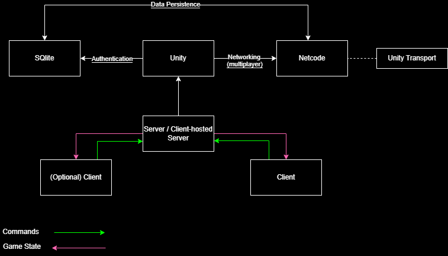

# Duality

[](https://unity3d.com)
[](http://unlicense.org/)

## The Game

**Duality** is a two-player LAN online co-op game where one player plays as **Strawberry Boy** and the other as **Banana Boy**. Each player's goal is to collect fruits of their own type and reach the winning spot with their partner without dying (by stepping into the other's territory or colliding with traps).

The game uses **Unity Netcode for GameObjects** for networking and **SQLite** for profile database management.

Tema usado: 
- Unity Netcode for Game Objects
  - (4) Implementar um jogo de acção, cliente/servidor, com login

## Table of Contents

- [The Game](#the-game)
- [Services Implemented](#services-implemented)
- [Structure](#structure)
  - [Login](#login)
  - [Server, Client, Host](#server-client-host)
- [Procedure](#procedure)
  - [Database](#database)
  - [Spawning](#spawning)
  - [Increasing the Scores](#increasing-the-scores)
  - [Winning / Losing](#winning--losing)
- [Network Architecture](#network-architecture)
- [Game Scene Flow Architecture](#game-scene-flow-architecture)
- [Considerations](#considerations)
- [License](#license)
- [Bibliography](#bibliography)

# Services implemented:
- [Netcode for GameObjects](https://unity.com/pt/products/netcode)  
  Unity library used to synchronize GameObject and game state data across all clients in a networking session.

## Structure

Each scene in Duality has an entry point component sitting on a root-level GameObject that serves as a scene-specific menu manager of sorts.

---

### Login

Upon starting the game, players can choose to:

- **Login** – Verifies credentials in the SQLite database and loads the profile if valid.
- **Signup** – Creates a new account if the chosen username is not already taken.
- **Play as a Guest** – Allows gameplay without saving progress or accessing the profile screen.

A logged-in player has access to their progression and stats via a profile icon in the main menu.

Choosing to ___Login___ will lookup the input put by the player in the *Username* and *Password* fields on the SQlite database. If the data matches any entry, then the profile information is sent back and sends the player to the main menu successfully.

Choosing to ___Signup___ will take the player to the Signup screen, where they can input an *Username* and *Password*. The game will check that the Username does not already exist; if this check passes, the account is created successfully and the player is sent to the main menu, already logged in.

Both these options will make it so that a profile icon in the main menu is shown. Clicking on that icon will take the player into a screen where they're shown their progression and stats through the game.

Choosing to ___Play as a Guest___ will simply take the player to the main menu. The player won't have access into the profile screen, and their progress will not be saved.

---

### Server, Client, Host

In the main menu, players can choose one of three modes:

- **Server**
- **Host**
- **Client** (requires a running server or host to connect)

If selecting *Client* without a server or host active, nothing happens.

## Procedure

### Database

The SQLite database is managed by `DatabaseManager`:

- Attempts to locate `unity.db` in `Application.persistentDataPath`.
- If missing, it creates a new one.

If we were using a dedicated server to host the database (as we should in a real world case scenario), `DatabaseManager` would instead try to connect to the server by its URI and send its queries to it. If the server couldn't detect the database, it would log an error.

In any case, the process of creating a new database is expedited by the SQlite .dll libraries for .NET and Unity:

```
void CreateDatabase()
{
    string connection = "URI=file:" + _dbPath;
    using (var conn = new SqliteConnection(connection))
    {
        conn.Open();
        using (var cmd = conn.CreateCommand())
        {
            cmd.CommandText = "CREATE TABLE IF NOT EXISTS users (" +
                              "id INTEGER PRIMARY KEY AUTOINCREMENT, " +
                              "username TEXT NOT NULL, " +
                              "password TEXT NOT NULL, " +
                              "matches_played INTEGER DEFAULT 0, " +
                              "wins INTEGER DEFAULT 0, " +
                              "losses INTEGER DEFAULT 0, " +
                              "total_score INTEGER DEFAULT 0)";
            cmd.ExecuteNonQuery();

            cmd.CommandText = "INSERT INTO users (username, password) VALUES ('johndoe', 'johndoe'), " +
                              "('johnsmith', 'johnsmith')";
            cmd.ExecuteNonQuery();
        }
        conn.Close();
    }
}
```

---

### Spawning

Upon joining a game with a Server or Host already running:
- As NetworkManager calls `OnConnectionEvent`, the LevelController script, responsible for handling the level and player spawns, will:
  - Instantiate a player prefab
  - Assign it to the client
  - Set the prefab up to the corresponding Fruit Boy
    
    ```
    PlayerMove player = Instantiate(strawberryPlayer, Vector3.zero, Quaternion.identity);
    player.transform.position = _currentLevel.strawberrySpawnPos.position;
    player.GetComponent<PlayerScore>().textObject = strawberryScore;
    
    var prefabNetworkObject = player.GetComponent<NetworkObject>();
    prefabNetworkObject.SpawnAsPlayerObject(connectionEventData.ClientId, true);
    prefabNetworkObject.ChangeOwnership(connectionEventData.ClientId);
    ```

It is possible for a third player to join a Host session (or a fourth to join a Server session). In fact, there is no restriction on how many clients can join. However, no player object will be spawned for them, and they will effectively only be considered an observer/spectator.

---

### Increasing the Scores

During the level, the players can increase their score by collecting fruits of their own type.
- Upon collision with a fruit of their own type, the `Point` script will notify the Server of it. The Server will then ask LevelController to update the scores accordingly.
- The LevelController will update the scores Server-wise, and send a `[ClientRPC]` to update the score UI for all clients.
  - Although we already make checks throughout this process to only let the Server proceed, the `[ClientRPC]` attribute is used to further guarantee only the Server can change the scores.

    
  ```
  public void AddScore(FruitType team)
  {
      if (!IsServer)
      {
          return;
      }
      
      switch (team)
      {
          case FruitType.Strawberry:
              _strawberryScore++;
              strawberryScore.text = _strawberryScore.ToString();
              break;
          case FruitType.Banana:
              _bananaScore++;
              bananaScore.text = _bananaScore.ToString();
              break;
      }
  
      SyncScoreClientRpc(team);
  }
  ```

---

### Winning / Losing

A match/level has two possible outcomes: *Winning* or *Losing*, depending on if both players reach the winning spot or if one (or both) players die.

On a loss:
- The `PlayerKillable` object responsible for killing the player will:
  - Notify the Server of the collision.
  - Call `OnPlayerDeath` on the LevelController.
  - Since only the Server is allowed to control the flow of the game (losing, winning, restarting, etc.) we use the `[ServerRpc(RequireOwnership = false)]` attribute, so that even a Client can notify the Server about the collision. This is only used as a fallback in the case the Server itself does not detect it.
 
  ```
  [ServerRpc(RequireOwnership = false)]
  private void NotifyServerOfCollisionServerRpc(ulong playerNetworkObjectId)
  {
      if (NetworkManager.Singleton.SpawnManager.SpawnedObjects.TryGetValue(playerNetworkObjectId, 
              out var playerObject))
      {
          if (playerObject.TryGetComponent(out PlayerMove pm))
          {
              HandleCollision(pm);
          }
      }
  }
  ```
  
- The LevelController script will:
  - Change the time scale of the game to 0 on both the Server and the Clients, to simulate a pause.
  - Show the death UI, with two buttons:
    - Restart the level (only triggered when both players select it).
      - Selecting this will _teleport_ the players to the beggining of the level again, and set all collectible (fruits) gameobjects active again, as defined by the `LevelSectioner`.
    - Return to the main menu (triggered by any player).
   
On a win:
- The `WinPoint` object responsible for notifying a win will:
  - Notify the Server of the collision with the winning player.
  - Call `Win` on the player script.
  - The player will momentarily lose control of their character. They can always press _Shift_ to cancel their Win and gain control again. This prompt is only shown to the local client that reached the win point.
 
  ```
  [ClientRpc]
  private void ShowInputPromptClientRpc(ulong clientId)
  {
      if (NetworkManager.Singleton.LocalClientId == clientId)
      {
          inputPrompt.SetActive(true);
      }
  }
  ```

- The LevelController script will:
  - Change the time scale of the game to 0 on both the Server and the Clients, to simulate a pause.
  - Show the winning UI, with two buttons:
    - Go to the next level (only triggered when both players select it).
      - Selecting this will _teleport_ the players to the spawn point of the next level, as defined by the `LevelSectioner`.
    - Return to the main menu (triggered by any player).

---

___In both cases___, upon finishing a level (be either by losing or winning), a logged-in player will have their match data sent to the database. They can later see these results on the main menu screen, upon clicking on the profile icon. 

The used query to update the user profiles is:

```
cmd.CommandText = @"
                UPDATE users 
                SET 
                    matches_played = matches_played + @matchesPlayedIncrement,
                    wins = wins + @winsIncrement,
                    losses = losses + @lossesIncrement,
                    total_score = total_score + @totalScoreIncrement
                WHERE 
                    username = @username";
```

## Network Architecture



## Game Scene Flow Architecture


## Considerations

This project was an enjoyable experiment, though it came with challenges. Below are some of the key attempts and considerations:
- Creating a PHP server to use with MySQL for the login.
  - The initial plan included creating a PHP server to handle user login through MySQL. Due to unfamiliarity with the PHP language itself and also due to the complexity it would put on the user to run (e.g., the user would have to install PHP, configure a local server, install MySQL, manage a server database, and update the PHP script with the correct local MySQL credentials or alter them to fit the script), this approach was ultimately abandoned.
- Implementing a hosting lobby.
  - This was implemented almost to its full completion in earlier versions, following the Galactic Kittens educational demo (referenced in the Bibliography) sample. However, since it didn't properly fit the game, as we only have two players, the need for a lobby was insignificant, so it was removed from the final version.
  - The educational demo is still cited in the Bibliography, as reading through its Github repository provided some valuable insights on how to best structure the game to use _Netcode_.
- Full code separation on Client/Server
  - Although some of it still managed to make it into the final version, full separation, while definitely more valuable in a real case scenario, made the code be full of callbacks, which made some parts of the code that should be trivial, too complex. Furthermore, separating the code into Client/Server classes led to the surge of too many circular dependencies, which would further complicate already tightly coupled classes. For these reasons, this approach was scrapped.
 
## License

This project is released under the **Unlicense**. You are free to use, modify, distribute, and do whatever you want with this project. No attribution required. For full details, see the [LICENSE](LICENSE) file.

## Bibliography

- [Netcode Documentation on the Unity Networking Multiplayer Docs page](https://docs-multiplayer.unity3d.com/netcode/current/about/)
- [Galactic Kittens educational demo by Unity](https://github.com/UnityTechnologies/GalacticKittens)
- [SQlite Tutorial webpage](https://www.sqlitetutorial.net)
- [Importing SQlite into Unity and example of use](https://www.mongodb.com/developer/code-examples/csharp/saving-data-in-unity3d-using-sqlite/#sqlite)
